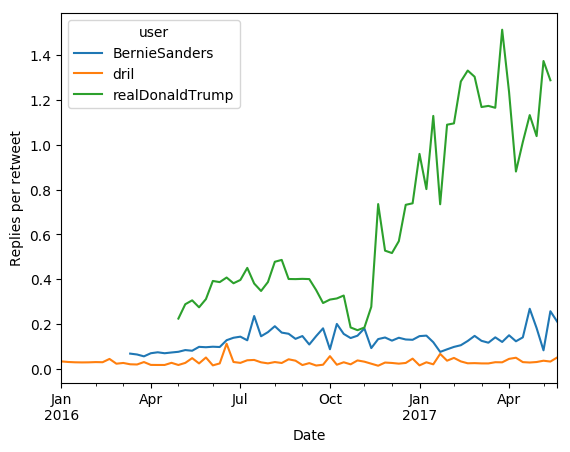

# Twitter reply-to-retweet ratio scraping code

This is the scraping and front-end code used to acquire and visualize the data
discussed in [A Quick Look at the Reply-to-Retweet
Ratio](http://blog.fastforwardlabs.com/2017/05/15/reply-retweet-ratio.html).

## Installation

Requirements: Python 3.6+

```bash
$ git clone git@github.com:fastforwardlabs/tweetratio.git
$ cd tweetratio
$ python3 -m virtualenv venv
$ source venv/bin/activate
$ pip install -r requirements.txt
$ mkdir raw processed  # for output
```

## Usage

To download `realDonaldTrump`'s last 3200 tweets as json, and add a
`reply_count` field to each tweet, do

```bash
$ python3 tweetratio.py realDonaldTrump
```

This code has to scrape as well as make API calls, so it will take 30-60
minutes, depending on the speed of your internet connection.

The tweets can then be found in `raw/realDonaldTrump.json`.

A minified copy of the tweets, which contains only the keys necessary for [the
visualization](http://www.fastforwardlabs.com/tweetratio/), is saved to
`processed/realDonaldTrump.json`.

## Frontend

To run [the
visualization](http://blog.fastforwardlabs.com/2017/05/15/reply-retweet-ratio.html)
locally, download data for `realDonaldTrump`, `BernieSanders`, `BarackObama`,
`HillaryClinton`, `GovMikeHuckabee`, `dril` and `SpeakerRyan`. If you'd like to
plot other accounts, download those and change
[`web/app.js`](https://github.com/fastforwardlabs/tweetratio/blob/master/web/app.js#L9-L18).

Then
```bash
$ mv processed/* web/data/
$ cd web
$ python3 -m http.server
```
and visit `localhost:8000`

## Analysis

`analysis.py` contains simple code to load the tweets as a pandas DataFrame.
For example:

```python
>>> import analysis
>>> tweets = analysis.load_df()
>>> analysis.plot_trend(tweets)
```

